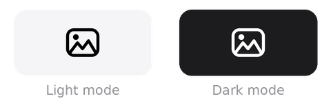

# WallRotate (MVP)

Menu-bar додаток для macOS, що автоматично міняє шпалери робочого столу,
підтягуючи зображення з **Unsplash** або **Hall of FRAMED** за заданим інтервалом.

Це MVP-білд: працює як фоновий додаток в рядку меню, міняє шпалеру
за таймером і має базові налаштування прямо в меню.



Іконка — монохромна **template-іконка**: macOS автоматично робить її чорною
у світлій темі та білою в темній (і підсвічує при кліку).

## Можливості
- Автоматична зміна шпалери за інтервалом (15 хв / 30 хв / 1 год / 3 год / 6 год).
- «Next wallpaper» — змінити негайно.
- «Pause / Resume» — призупинити ротацію.
- **Два джерела зображень** (перемикач у меню «Source»):
  - **Unsplash** — фотографії за ключовими словами через офіційне API.
  - **Hall of FRAMED** — куровані ігрові скріншоти з framedsc.com (без API-ключа).
- «Set theme…» — ключові слова для пошуку Unsplash (напр. `nature, mountains, ocean`).
- «Set Unsplash API key…» — вставити ключ без редагування коду.
- **Hall of FRAMED filters** — підменю з фільтрами для куратора:
  - Min score (≥ 5 / 10 / 25 / 50) — мінімальний рейтинг скріншоту.
  - Color group — фільтр за домінантною кольоровою групою.
  - Include / Exclude games — список ігор через кому (часткове співпадіння).
  - Лічильник «N shots match» показує скільки скріншотів проходять фільтр.
- «Launch at login» — автозапуск при вході в систему (галочка стану).
- Адаптивна template-іконка в menu bar (чорна у світлій темі, біла в темній).
- Підтримка кількох моніторів, включно з fullscreen-застосунками.
- Локальний кеш фото з обмеженням розміру.
- Дотримання правил Unsplash API (download-тригер + атрибуція автора з UTM).

## Крок 1. Отримати Unsplash Access Key (опційно, лише для Unsplash)
1. Відкрий https://unsplash.com/developers і увійди / зареєструйся.
2. **Your apps → New Application**, прийми умови.
3. Скопіюй значення **Access Key** (НЕ Secret Key).

> Demo-режим дає 50 запитів/год — для зміни раз на годину цього з головою.

> Для Hall of FRAMED ключ не потрібен — дані тягнуться з публічного
> JSON-репозиторію на GitHub. Цей крок можна пропустити, якщо плануєш
> користуватись лише цим джерелом.

## Крок 2. Встановити залежності
```bash
cd wallrotate
python3 -m venv .venv
source .venv/bin/activate
pip install -r requirements.txt
```

## Крок 3. Як запустити — три режими

WallRotate має три способи запуску. Обирай той, що відповідає твоїй ситуації.

### Режим А — з вихідного коду (для розробки)

Найшвидший шлях, якщо ти хочеш просто запустити або правиш код.

```bash
source .venv/bin/activate
python3 app.py
```

У рядку меню зʼявиться іконка WallRotate. Для роботи з Unsplash спочатку
встанови ключ (меню → **Set Unsplash API key…**) або:
```bash
export UNSPLASH_ACCESS_KEY="твій_access_key"
python3 app.py
```

Для Hall of FRAMED ключ не потрібен — обери **Source → Hall of FRAMED** у меню.

> **Коли підходить:** ітеративна розробка; швидко перевірити правку.
> **Мінус:** додаток живе, поки відкритий термінал; немає окремої іконки
> в `/Applications`; «Launch at login» посилатиметься на venv-Python і `app.py`.

### Режим Б — зібрати `.app` і встановити (для постійного користування)

```bash
./build_app.sh
cp -R dist/WallRotate.app /Applications/
open /Applications/WallRotate.app
```

`build_app.sh` робить чотири речі:
1. Створює `.venv` (якщо ще нема) і ставить залежності + `py2app`.
2. Чистить попередні `build/` і `dist/`.
3. Збирає standalone `WallRotate.app` через `py2app` у `dist/`.
4. **Ad-hoc підписує бандл** — обходить усі `.so`/`.dylib` у `Contents/Resources/`,
   фреймворк Python, бінарники, і запечатує бандл через `--deep`. Без цього
   кроку macOS Tahoe (14+) вбиває процес SIGKILL без жодного видимого
   повідомлення (можна побачити лише через `log show`: *rejecting invalid
   page in zlib.cpython-313-darwin.so*).

> **Коли підходить:** першочергова інсталяція; після змін у `setup.py`,
> `requirements.txt`, `assets/`, `models.py`, `providers/`, `config.py`,
> `cache.py`, `launch_agent.py` — тобто будь-що, окрім `app.py`/`wallpaper.py`.
> **Тривалість:** ~50–90 секунд (повний rebuild).

Перший запуск некваліфікованого `.app` Gatekeeper може блокувати —
відкрий через **праву кнопку → Open** (або System Settings → Privacy &
Security → Open Anyway).

### Режим В — швидкий деплой змін (для ітерацій по `app.py` / `wallpaper.py`)

```bash
./deploy.sh
```

`deploy.sh` оновлює **лише два файли** в уже встановленому
`/Applications/WallRotate.app` і перезапускає його:
- `app.py` → копіює в `Contents/Resources/app.py` (py2app читає `.py` напряму).
- `wallpaper.py` → компілює в `.pyc` і вкладає у внутрішній `python3.13.zip`.

> **Коли підходить:** ти правиш лише `app.py` чи `wallpaper.py` і хочеш
> побачити результат за пару секунд замість 60+ секунд повного rebuild.
> **Не підходить для:** змін у `cache.py`, `config.py`, `models.py`,
> `providers/*.py`, `requirements.txt`, `setup.py`, `launch_agent.py`,
> `assets/`. Якщо змінив щось із цього — потрібен повний `./build_app.sh`.

### Порівняння режимів

| | Режим А (dev) | Режим Б (build) | Режим В (deploy) |
|---|---|---|---|
| Команда | `python3 app.py` | `./build_app.sh` + `cp` | `./deploy.sh` |
| Тривалість | миттєво | ~60–90 с | ~2 с |
| Що оновлюється | усе | усе | лише `app.py` + `wallpaper.py` |
| Іконка в `/Applications` | ні | так | так (вже має бути) |
| Підходить для | розробки | першого встановлення, змін поза `app.py` | швидкої ітерації |

## Де зберігаються дані
- Налаштування: `~/Library/Application Support/WallRotate/config.json`
- Кеш фото: `~/Library/Application Support/WallRotate/cache/`

## Структура проекту
```
wallrotate/
├── app.py              # точка входу: меню-бар, таймер, дії
├── config.py           # налаштування (JSON) і шляхи
├── models.py           # модель Photo
├── wallpaper.py        # встановлення шпалери (NSWorkspace / osascript)
├── cache.py            # завантаження і кеш фото
├── launch_agent.py     # автозапуск при вході (LaunchAgent)
├── providers/
│   ├── base.py         # інтерфейс ImageProvider
│   ├── unsplash.py     # реалізація для Unsplash
│   └── framedsc.py     # реалізація для Hall of FRAMED
├── assets/             # template-іконка menu bar (svg/pdf/png) + прев'ю
├── requirements.txt
├── requirements-dev.txt # інструменти збірки (setuptools, wheel, py2app)
├── build_app.sh        # повна збірка + ad-hoc підпис .app (Режим Б)
├── deploy.sh           # швидкий гарячий деплой app.py/wallpaper.py (Режим В)
└── setup.py            # конфіг py2app (Info.plist, packages, options)
```

## Додати нове джерело
Реалізуй `ImageProvider` (`providers/base.py`) у новому файлі в `providers/`
і поверни `Photo` з `get_random()`. Unsplash — приклад у `providers/unsplash.py`.

## Автозапуск при вході
У меню є пункт **«Launch at login»**. Увімкнення створює LaunchAgent у
`~/Library/LaunchAgents/dev.wallrotate.app.plist`. Він набуває чинності
при **наступному** вході в систему (щоб не запускати другий екземпляр поверх
уже відкритого). Працює і для запуску зі скрипта, і для зібраного `.app`.

> Якщо запускаєш у Режимі А (з venv) — автозапуск посилатиметься на той самий
> інтерпретатор і `app.py`. Для стабільного автозапуску краще використати
> Режим Б (`./build_app.sh` + копія в `/Applications`) і ввімкнути
> «Launch at login» уже в зібраному `.app`.

## Деталі збірки

Якщо `build_app.sh` не годиться (потрібен ручний контроль), збирати можна напряму:
```bash
source .venv/bin/activate
pip install -r requirements-dev.txt   # setuptools, wheel, py2app
python setup.py py2app
```

> Помилка `No module named 'setuptools'` — команду запущено поза venv або в
> системному python3. Активуй venv і встанови `requirements-dev.txt`.

**Важливо для macOS 14+:** після `python setup.py py2app` бандл треба
переподписати, бо py2app залишає `.so`-розширення з tainted-сторінками.
Саме це робить крок 5 у `build_app.sh` — продивись там, якщо збираєш вручну.

Для швидкої перевірки коду під час розробки є alias-режим — не standalone,
але збирається миттєво й бачить твої файли напряму:
```bash
python setup.py py2app -A
```

- `LSUIElement=True` (в `setup.py`) робить додаток фоновим (без іконки в Dock).
- Іконки з `assets/` автоматично пакуються в `Contents/Resources/assets/`.

Для роздачі іншим знадобиться підпис Developer ID + нотаризація Apple
(ad-hoc підпис із `build_app.sh` достатній лише для локального використання).

## Ліцензія на фото

**Unsplash.** Зображення надаються Unsplash згідно з їхньою ліцензією та
[API Guidelines](https://help.unsplash.com/en/articles/2511245-unsplash-api-guidelines).
Додаток виконує обовʼязковий download-тригер і показує автора з посиланням.

**Hall of FRAMED.** Скріншоти з [framedsc.com](https://framedsc.com) — куроване
ком'юніті фотографів усередині відеоігор. Авторські права належать
ігровим студіям і авторам скріншотів; пункт меню «Open author» відкриває
профіль автора. Скріншоти проєкту Hall of FRAMED призначені для особистого
некомерційного використання як шпалери.
